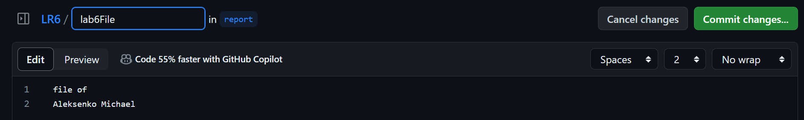
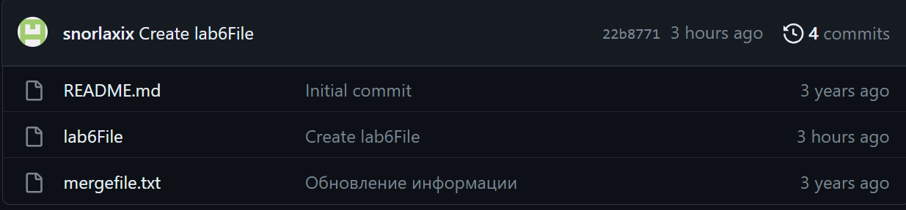
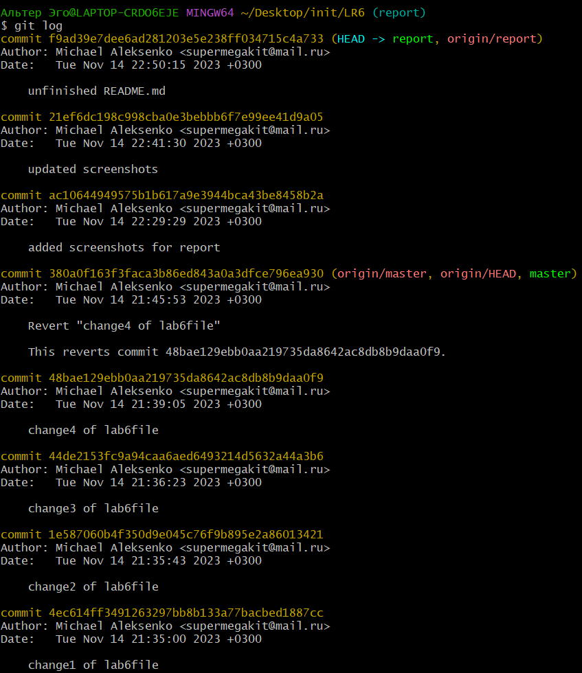
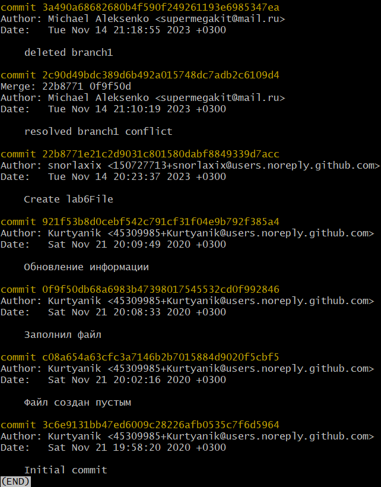
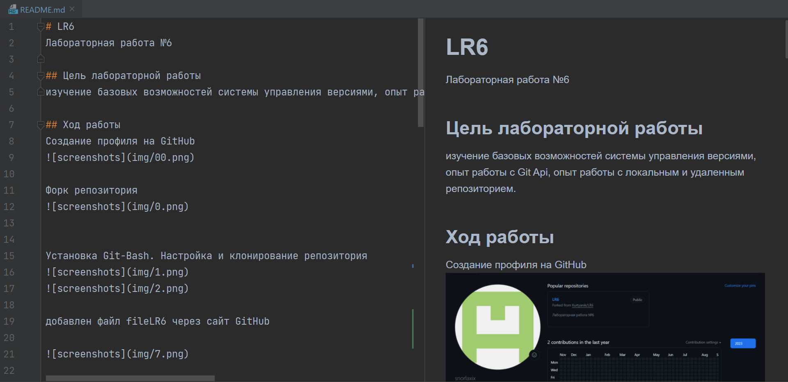

# LR6
Лабораторная работа №6

## Цель лабораторной работы
изучение базовых возможностей системы управления версиями, опыт работы с Git Api, опыт работы с локальным и удаленным репозиторием. 

## Ход работы
Создание профиля на GitHub

Форк репозитория 

Установка Git-Bash. Настройка и клонирование репозитория
 

добавлен файл fileLR6 через сайт GitHub

Получена история операций для ветки *master* 

И для ветки *branch1*

Посмотрены последние изменения для ветки *master* 

И для ветки *branch1*

Выполнено слияние ветки *branch1* в ветку *master* 

Получен конфликт слияния

Разрешенный конфликт слияния, сделан коммит к действиям

Удаление побочной ветки

Подтверждение удаления

Сделал 4 изменений в файле с коммитами. Действия для остальных коммитов проводил по данной аналогии

Откат последнего коммита c использованием его хэша

Создание ветки для отчета

История операций

История операций в упрощенном варианте

С файлом README.md работал в pycharm

## Вывод
Изучены базовые возможности системы управления версиями, получен опыт работы с Git Api и опыт работы с локальным и удаленным репозиторием